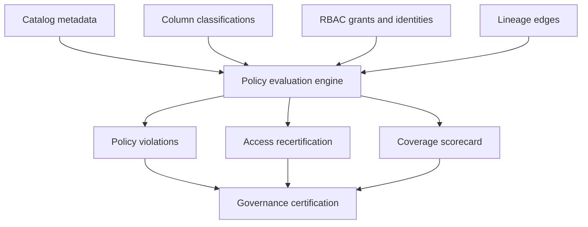

# Banking Data Governance & Privacy Control Plane

A metadata-driven governance project that inventories banking datasets, classifies sensitive columns, validates masking coverage, reviews role-based access, detects segregation-of-duties conflicts, checks lineage completeness, and produces audit-ready control evidence.

This is a synthetic portfolio implementation inspired by enterprise data-governance responsibilities. It contains no employer data, customer information, proprietary policy or internal source code.

## Business problem

A governed lakehouse is more than a collection of pipelines. Risk, compliance and security teams need to know who owns each dataset, which fields contain PII, whether sensitive fields are masked, who can access them, whether access remains justified, and how reporting data traces back to registered sources.

This project converts catalog metadata into repeatable controls for:

- ownership accountability;
- column-level classification and masking;
- least-privilege RBAC review;
- expired and inactive grant detection;
- segregation of duties;
- lineage integrity and coverage;
- evidence hashing and certification.

## Architecture



## Verified demo

| Measure | Result |
| --- | ---: |
| Datasets | 12 |
| Columns | 96 |
| Lineage edges | 12 |
| Access grants | 12 |
| Identities | 6 |
| Total policy violations | 11 |
| Critical / high / medium | 1 / 9 / 1 |
| Dataset ownership coverage | 91.67% |
| Restricted-column masking coverage | 75.00% |
| Grants: keep / review / revoke | 7 / 1 / 4 |
| Governance certification | **NON_COMPLIANT** |

The input catalog deliberately includes negative-control scenarios. `NON_COMPLIANT` proves that the engine detects blocking governance issues; it is not a software failure.

## Quick start

Requirements: Python 3.10 or newer. No third-party packages are required.

```bash
git clone <your-repository-url>
cd banking-data-governance-control-plane
make demo
make test
```

Windows:

```powershell
run_demo.bat
run_tests.bat
```

## Outputs

- `data/output/policy_violations.csv` — finding, severity, affected object and remediation;
- `data/output/access_review.csv` — keep/review/revoke decision for every grant;
- `data/output/governance_summary.json` — control and coverage metrics;
- `data/output/governance_scorecard.md` — review-ready summary;
- `data/output/control_evidence.json` — hashes of policy and catalog inputs;
- `data/output/governance_controls.db` — SQLite database for exploration.

## Resume alignment

The project directly demonstrates skills listed in the resume: Unity Catalog concepts, RBAC, PII masking, lineage, auditability, secure access controls, DataHub/Apache Atlas-style metadata, PCI-DSS and BCBS 239 control thinking. Demo counts are synthetic and should not be presented as production achievements.

## Why it is different from the earlier projects

This repository does not process payments, calculate fraud risk, reconcile financial balances, or implement a Bronze/Silver/Gold transaction lakehouse. Its primary data is metadata, and its output is governance decisions and access-control evidence.

## Enterprise deployment

The same model can ingest metadata from Unity Catalog, Snowflake account usage, DataHub or Apache Atlas; execute scheduled policy-as-code checks; publish findings to a workflow system; and expose governance scorecards to security, risk, data owners and auditors.

## Documentation

- [Architecture and controls](docs/ARCHITECTURE.md)
- [Interview guide](docs/INTERVIEW_GUIDE.md)
- [Operations runbook](docs/RUNBOOK.md)

## Responsible portfolio use

Describe this as an independently implemented, sanitized demonstration of governance patterns. Do not imply that it is a copy of an employer's platform or policy library.

## License

MIT License. See [LICENSE](LICENSE).

